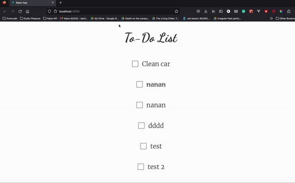
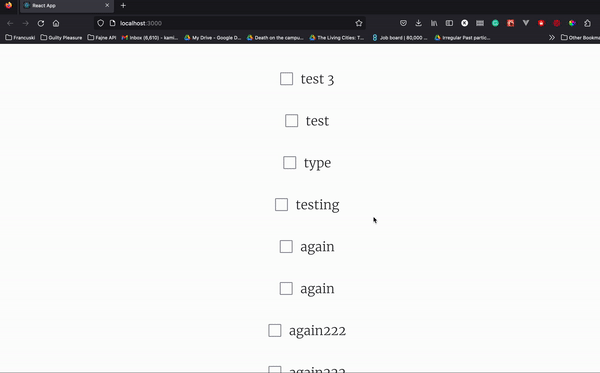

Hello!

1. I decided to go with monolithic approach of having API and frontend in one folder.
2. I used yarn react-app to set up quick react app
3. I did wasted a bit of time as I started with JavaScript and only later on I moved to TypeScript. I did that as in the requirements for this job it was mentioned that one needs to have a great knowledge of Node.JS.
4. After recreating the project and this time in TypeScript, I decided to use styled components to show how usually I think it's nice to set up projects: a folder for pages that use components from another folder.
5. I managed to post the to-do task and get the to-do. I wasted some time debugging some TypeScript type issues (todos were complaining that they are not a function - I needed to console log the output from the API to realise that it is wrapped like this {data: [{}]})
6. I downloaded some fonts from Google Font to make it nicer looking.
7.

To run the app: Place in one folder frontend and api. Run Api first, then frontend.

